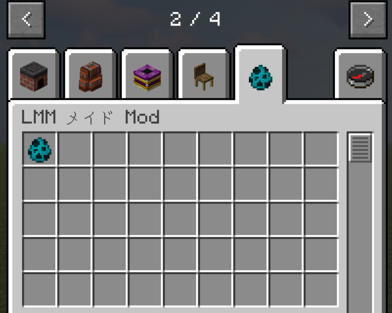
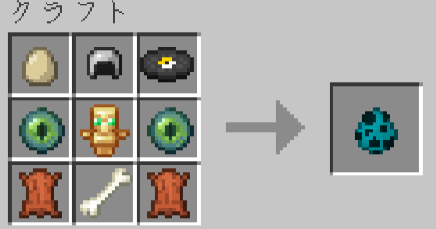
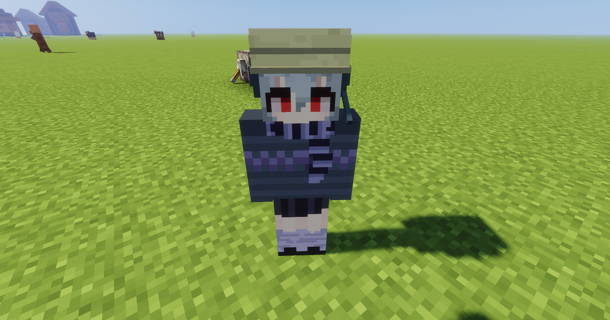
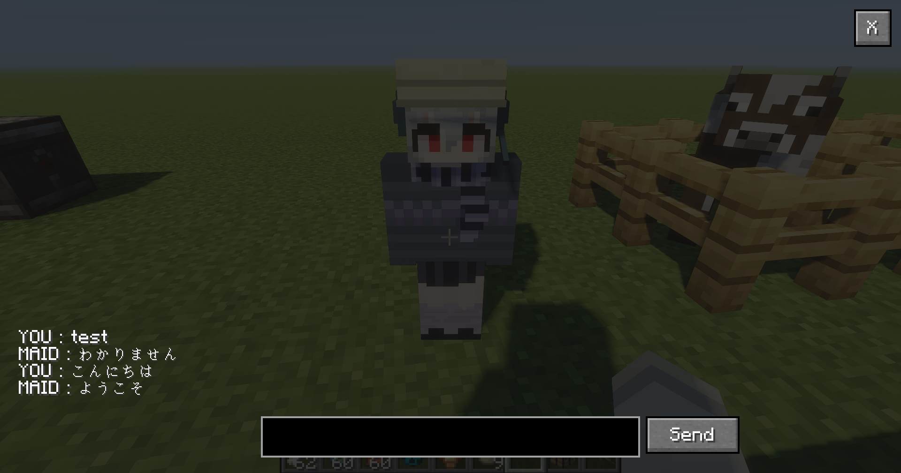

# LMMMaidMod
このmodはLMMを用いて会話することができるmobを追加します。  
現段階では会話機能は実装していません。   

メイド(mob)を召喚するスポーンエッグを追加します。  

レシピは以下のようにしてください。  
  
皮はウサギの皮で代用可能です。  
また、レコードもすべてのレコードで代用できます。  

このスポーンエッグを使用するとメイドが召喚されます。  
   

このメイドを右クリックすると以下のGUIが表示され会話できるようになります。  
 

現段階ではLMMを用いた会話は実装していません。大事なことなので2回言いました  
また、入力欄の入力制限をなくすことと、スクロール機能を実装したいと考えています。  (実装が上手く行かない)

# アップデート履歴
## 0.3.0  
2023年12月3日  
レシピとスポーンエッグを追加

## 0.2.0  
mobをクリックした際にGUI表示

## 0.1.0  
mobを追加
